# Spring Boot Introduction

Spring had been often criticized for being a XML metadata configuration oriented framework. Then, Spring JavaConfig has appeared. Its goal was to focus on a Java centric Spring configuration through different annotations like @Configuration, @Bean and the AnnotationConfigApplicationContext implementation. Spring JavaConfig was a trampoline for what now is known as Spring Boot.

#### Spring Boot makes it easy to create stand-alone, production-grade Spring based Applications that you can "just run". The main idea is "convention over configuration"（约定大于配置）.

### Pros
- Out-of-the-box, start a spring project quite easily and quickly
	- Not that much XML (automatically configure Spring whenever possible)
	- Embed Tomcat, Jetty or Undertow directly (no need to deploy WAR files)
	- Simplified dependency management through the starter POMs
	- Better support for Jackson, JDBC, Mongo, Redis, Mail and so on.
- Agile development  
- Rapid iteration and update (Pivotal and Netflix)
- Provide production-ready features such as metrics, health checks and externalized configuration
- Better integration with Spring ecosystem (Spring AMQP, Spring Security, Redis, etc)
() 

### Cons
- Many traps 
- Less documents relatively (especially JavaConfig concerned)
- Spring Boot sticks good with microservices, which means it may not be quite suitable for large projects.

### Common Dependencies 
- spring-boot-starter-web:support for full-stack web development, including Tomcat and Spring-webmvc  
- spring-boot-starter-mail:support for javax.mail  
- spring-boot-starter-ws: support for Spring Web Services  
- spring-boot-starter-test:support for test frameworks，includng JUnit，Hamcrest, Mockito and so on  
- spring-boot-starter-actuator:Provide production-ready features such as metrics, health checks and externalized configuration  
- spring-boot-starter-jetty:support for jetty  
- spring-boot-starter-log4j:default log framework（logback） 

# Micro Services Introduction 

Quite easy to set up a micro service using Spring, Spring Boot and Spring Cloud.  
Much of Spring Boot is aimed at developer productivity by making common concepts, like RESTful HTTP and embedded web application runtimes, easy to wire up and use. The Spring Boot team has provided a convenient mechanism for getting started with building applications, known as the Spring Initializr. 

    
 </img>  
 
(From  <a>http://microservices.io/i/Microservice_Architecture.png</a>)

For all these services are independent Java processes, so the communication between these processes is IPC (inter process communication), two ways are common:  

- Sync   
	- REST（JAX-RS，Spring RestTemplate）  
	- RPC（Thrift, Dubbo）  
- Async  
	- Kafka， Notify， MetaQ  

    
 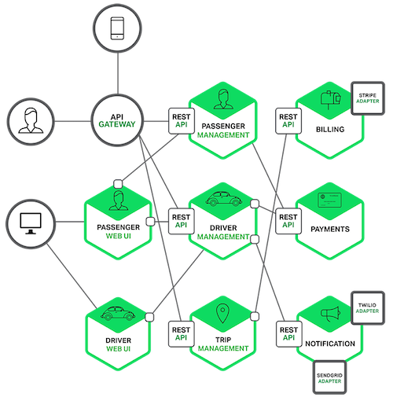</img>  
 
(From  <a>https://www.nginx.com/blog/introduction-to-microservices/</a>)

---

# Start a Application

Mostly with Maven or Gradle 

### IntelliJ IDEA 
This simple way need to be Internet-connected, otherwise you may need to create and configure the files manually.  

- Create a new project
- Choose “Spring Initializr” (and set the Project SDK if not set before)
	
    
	 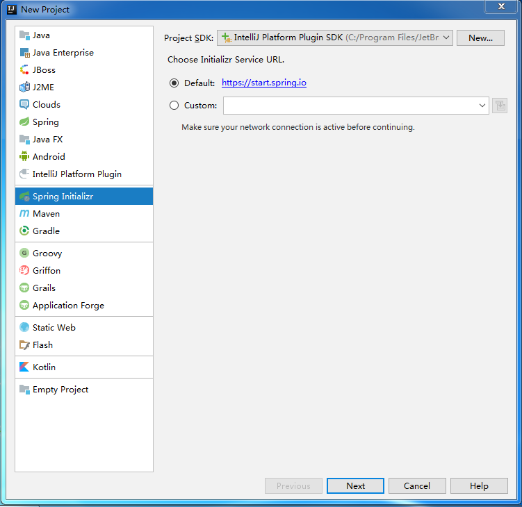</img>  
	

- Set the attributes
	
    
	 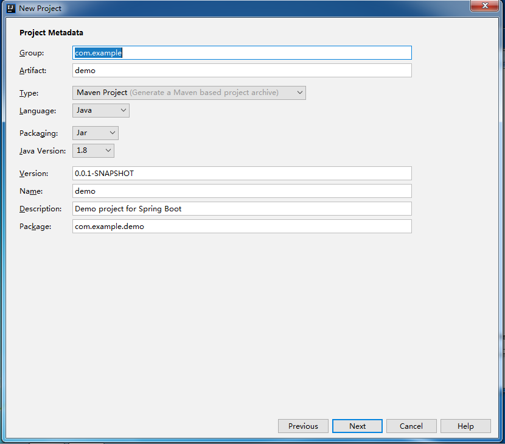</img>  
	

- Choose the dependencies
	
    
	 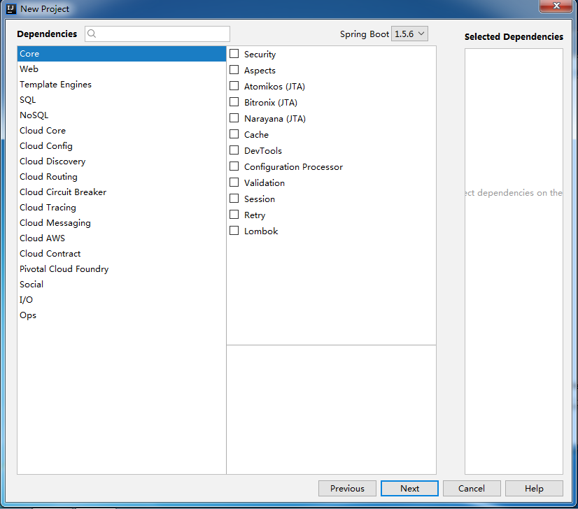</img>  
	

- The "DemoApplication" of com.example.demo package is the "main" of all. The dependency management codes are placed at pom.xml or build.gradle file.
	
    
	 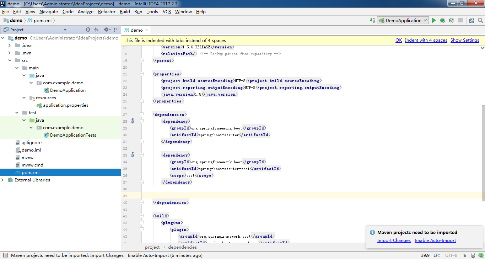</img>  
	 
 Maven 
   
	 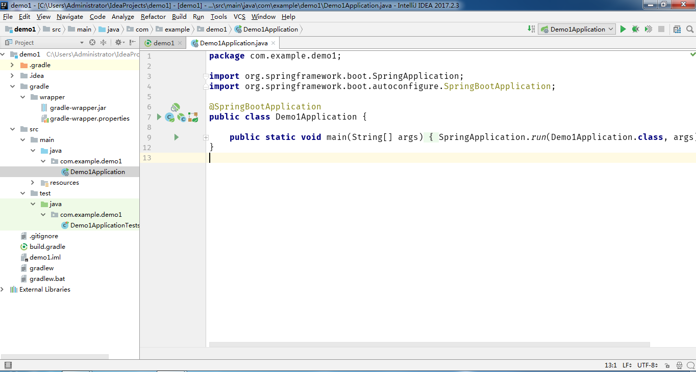</img>  
	 
 Gradle 

	

- Add dependencies needed
	
    
	 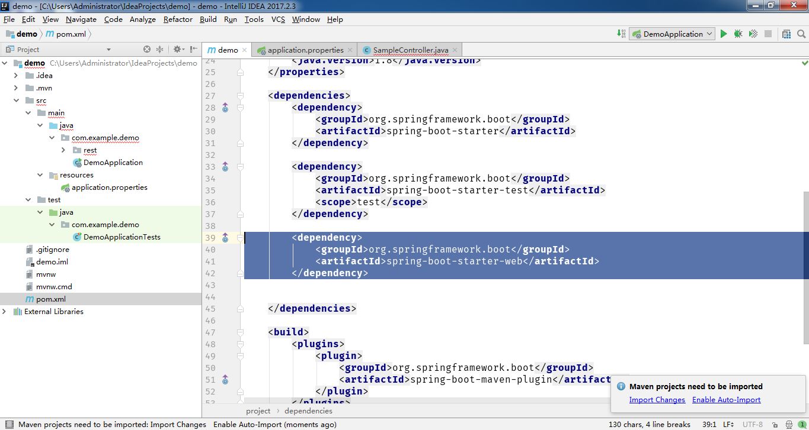</img>  
	 
 Maven 
   
	 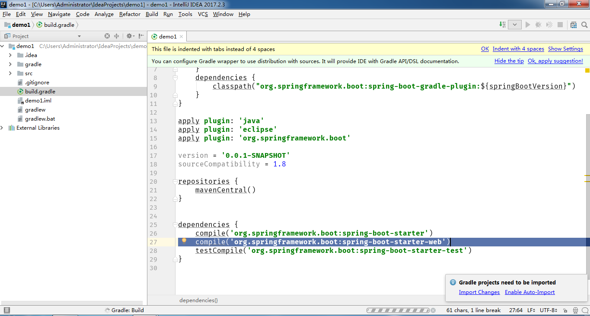</img>  
	 
 Gradle 

	

- Add controller
	
    
	 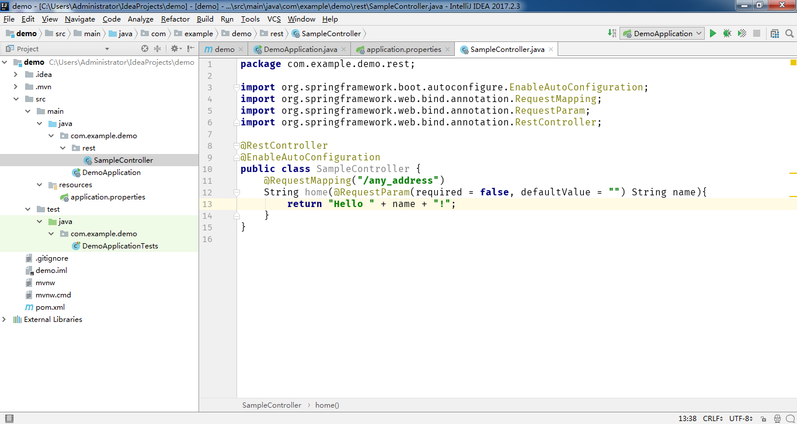</img>  
	

- Run After "Import Changes"  
	
    
	 </img>  
	 </img>
	 
 Then click the run button 

	 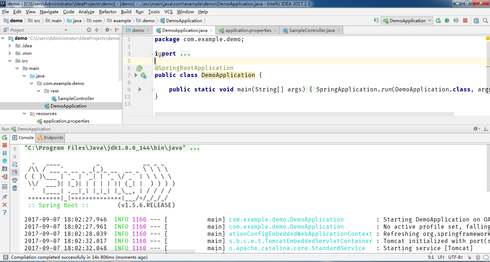</img>
	 
 This means run successfully 

	 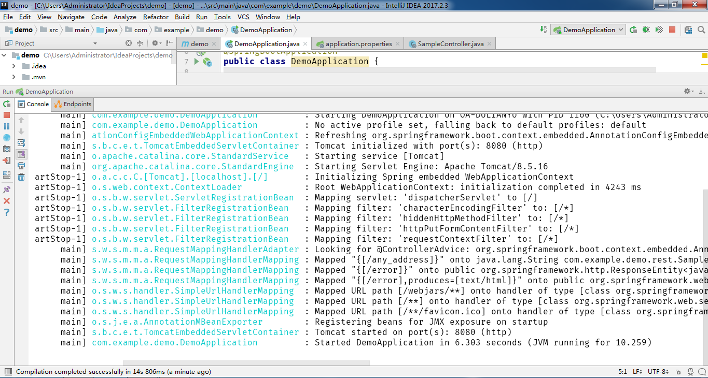</img>
	   
	

- Browse "localhost:8080/any_address" 
	
    
	 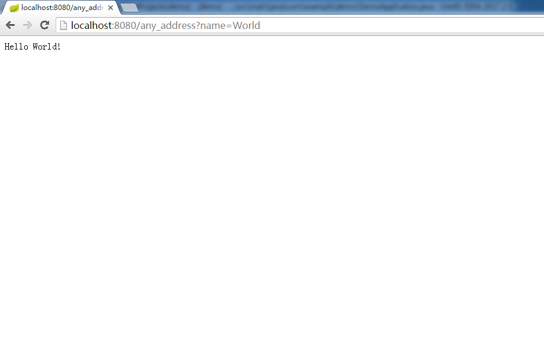</img>  
	

- Finish the simplest example

---

### Terminal 
- Set the environment according to the operating system
	- Java jdk&jre in correct version
	- Gradle/Maven in correct version
- Create pom.xml or build.gradle file
- Create the java files correspondingly
- For maven: 
	
		mvn dependency:tree
		mvn spring-boot:run
	
	For Gradle:
	
		gradle build
		gradle run
	
- Browse "localhost:8080"  

---

### References:  
<a>
- https://projects.spring.io/spring-boot/  
- https://www.gitbook.com/book/qbgbook/spring-boot-reference-guide-zh  
- http://rabbitstack.github.io/spring/spring-boot-or-not-to-spring-boot/  
- https://spring.io/blog/2015/07/14/microservices-with-spring  
- https://www.nginx.com/blog/introduction-to-microservices/  
- https://www.youtube.com/watch?  v=SFDYdslOvu8&list=PLNG30UThlcBxw5d4_yZ67z-KVIZ7DWO59&index=1  
- http://www.souvc.com/?p=2608
- http://www.jianshu.com/p/3d788198efab  
- http://www.jianshu.com/p/572f264d0bb5  
- https://www.zhihu.com/question/39483566  
- http://www.cnblogs.com/huang0925/p/4347690.html  
- http://ylcodes01.blog.51cto.com/5607366/1961974  	
</a>
	